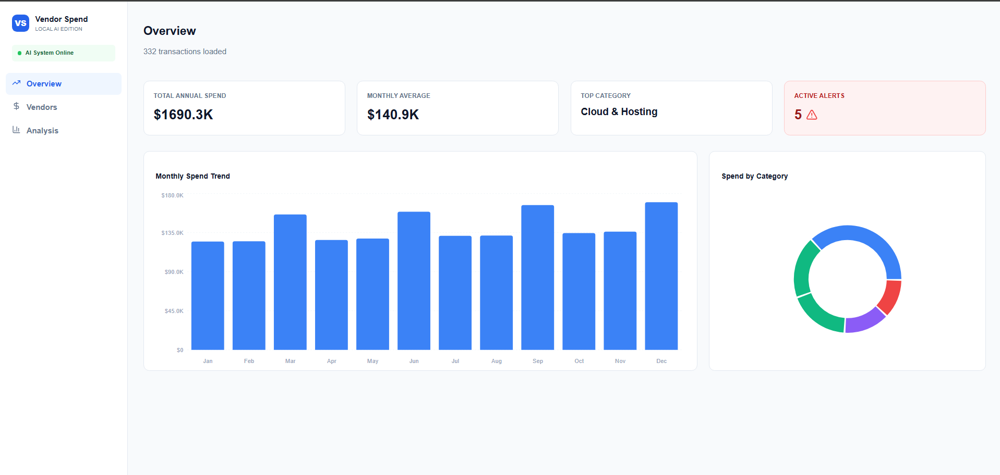
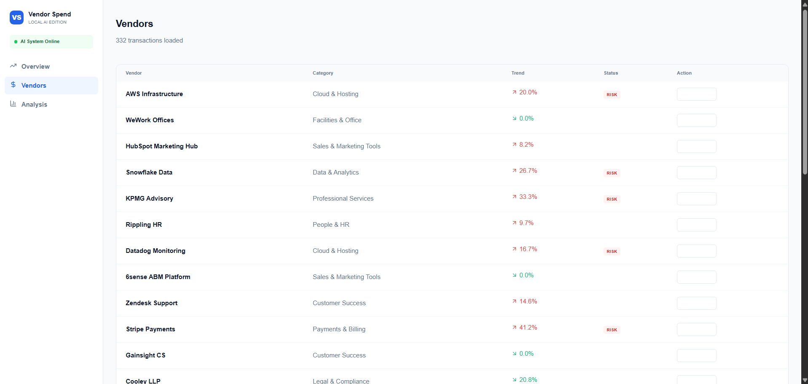

# Local AI Vendor Spend Analyst

> **A privacy-first financial intelligence dashboard that uses a local AI model (Mistral 7B via Ollama) to analyze SaaS vendor spending, flag cost anomalies, and generate executive-ready decision reports — all without sending a single byte to the cloud.**



---

## Table of Contents

- [Project Overview](#project-overview)
- [Why This Exists](#why-this-exists)
- [Key Features](#key-features)
- [Screenshots](#screenshots)
- [Architecture & Workflow](#architecture--workflow)
- [Tech Stack](#tech-stack)
- [Project Structure](#project-structure)
- [Installation & Setup](#installation--setup)
- [Usage Guide](#usage-guide)
- [Data Schema](#data-schema)
- [Roadmap](#roadmap)
- [License](#license)

---

## Project Overview

**Local AI Vendor Spend Analyst** is a B2B fintech MVP that helps finance teams understand *where their money goes* across SaaS vendors — and more importantly, *why costs are rising*.

Most companies manage 50–200+ SaaS subscriptions. Spend creep (gradual, unnoticed cost increases) is one of the biggest hidden drains on operating budgets. This tool surfaces those trends automatically, lets users investigate with an AI copilot, and produces structured reports for stakeholders.

The critical differentiator: **everything runs locally**. The AI engine (Mistral 7B) is served via [Ollama](https://ollama.ai) on the user's own machine. No API keys. No cloud inference. No data leaves the building.

---

## Why This Exists

In B2B finance, three problems recur constantly:

1. **Spend Visibility** — Finance teams lack a unified view of vendor costs across departments and categories.
2. **Spend Creep** — Vendors increase prices 5–15% annually, often unnoticed until budget reviews.
3. **Decision Documentation** — When action *is* taken, the rationale rarely makes it into a structured record.

This project addresses all three in a single workflow: **See → Investigate → Decide → Document**.

The local-AI approach adds a fourth value: **data privacy**. For industries with strict compliance requirements (healthcare, government, finance), sending vendor invoices to a third-party LLM API is often a non-starter.

---

## Key Features

### 100% Offline AI — No Cloud, No API Keys
The entire AI pipeline runs on your machine via Ollama + Mistral 7B. Your financial data never touches an external server.

### Executive Overview Dashboard
KPI cards showing total annual spend, monthly averages, top spending categories, and active risk alerts — all computed in real-time from your CSV.

### Vendor Risk Table
A sortable vendor list with computed spend trends (first-to-last invoice comparison), automatic **RISK** flagging for vendors with >15% cost increases, and status tracking for reviewed vendors.

### AI-Powered "Take Action" Drawer
Click any vendor to open a conversational side panel where Mistral 7B:
- Automatically analyzes the vendor's spend trend and financial impact
- Answers follow-up questions in context
- Maintains conversation history for the session

### Auto-Summarize to Decision Report
One click converts the entire AI conversation into a structured summary with **Pain Points**, **Proposed Solutions**, and **Final Decision** — then saves it to an in-app report log.

### Export to Word Document (.doc)
All logged decisions can be exported as a formatted `.doc` file, ready to share with leadership, procurement, or audit teams.

### Per-Vendor Deep Analysis
A dedicated Analysis tab with a dropdown selector to view any vendor's 12-month spend trajectory as an interactive bar chart.

---

## Screenshots

| Overview Dashboard | Vendors Table |
|---|---|
|  |  |

| AI "Take Action" Drawer | Analysis Deep Dive |
|---|---|
|  |  |

---

## Architecture & Workflow

### System Architecture

```
┌─────────────────────────────────────────────────────────┐
│                    USER'S MACHINE                        │
│                                                         │
│  ┌──────────────┐    HTTP     ┌──────────────────────┐  │
│  │   Frontend    │ ────────── │    Backend (Express)  │  │
│  │   React/Vite  │  :5173     │    Node.js  :3001     │  │
│  │              │             │                      │  │
│  │  • Dashboard  │            │  /api/health         │  │
│  │  • Vendors    │  ◄──────── │  /api/explain        │  │
│  │  • Analysis   │   JSON     │  /api/chat           │  │
│  │  • Drawer AI  │            │         │            │  │
│  └──────────────┘            └─────────┼────────────┘  │
│                                        │               │
│                                HTTP :11434             │
│                                        │               │
│                              ┌─────────▼────────────┐  │
│                              │   Ollama (Local AI)   │  │
│                              │   Mistral 7B Model    │  │
│                              │   No internet needed  │  │
│                              └──────────────────────┘  │
│                                                         │
│  ┌──────────────┐                                       │
│  │  CSV Data     │  Loaded by frontend at startup       │
│  │  (332 rows)   │  Parsed via PapaParse               │
│  └──────────────┘                                       │
└─────────────────────────────────────────────────────────┘
```

### User Workflow Map

```
                        ┌──────────────┐
                        │  Load CSV    │
                        │  (Startup)   │
                        └──────┬───────┘
                               │
                    ┌──────────▼──────────┐
                    │   Overview Tab       │
                    │   • KPI Cards        │
                    │   • Monthly Trend    │
                    │   • Category Donut   │
                    └──────────┬──────────┘
                               │
              ┌────────────────┼────────────────┐
              │                                 │
   ┌──────────▼──────────┐          ┌───────────▼──────────┐
   │    Vendors Tab       │          │    Analysis Tab       │
   │   • Risk Flags       │          │   • Vendor Selector   │
   │   • Trend %          │          │   • 12-Month Chart    │
   │   • Status Tracking  │          └──────────────────────┘
   └──────────┬──────────┘
              │
              │  Click "Take Action"
              │
   ┌──────────▼──────────────────┐
   │   AI Drawer (Side Panel)     │
   │   • Auto-analysis on open    │
   │   • Chat with Mistral 7B     │
   │   • Full conversation log    │
   └──────────┬──────────────────┘
              │
              │  Click "Auto-Summarize & Save"
              │
   ┌──────────▼──────────────────┐
   │   Decision Report Log        │
   │   • Pain Points              │
   │   • Proposed Solution        │
   │   • Final Decision           │
   └──────────┬──────────────────┘
              │
              │  Click "Export Report (.doc)"
              │
   ┌──────────▼──────────────────┐
   │   Word Document Download     │
   │   • Formatted for            │
   │     stakeholder review       │
   └─────────────────────────────┘
```

### AI Decision Flow (Drawer Logic)

```
User clicks "Take Action" on a vendor
        │
        ▼
Frontend sends vendor context to /api/chat
(name, annual spend, trend direction, trend %)
        │
        ▼
Express backend builds a CFO-analyst prompt
        │
        ▼
Ollama processes via Mistral 7B locally
        │
        ▼
AI response rendered in chat drawer
        │
        ▼
User asks follow-up questions (context preserved)
        │
        ▼
"Auto-Summarize" sends full conversation to AI
with instruction to extract Pain Points / Solution / Decision
        │
        ▼
Structured summary saved to in-app report log
        │
        ▼
Report log exportable as .doc file
```

---

## Tech Stack

| Layer | Technology | Purpose |
|---|---|---|
| **Frontend** | React 18 + Vite | Fast SPA with hot module reload |
| **Charts** | Recharts | Interactive bar charts and donut/pie charts |
| **Icons** | Lucide React | Clean, consistent iconography |
| **Styling** | Inline CSS (Tailwind-inspired) | Rapid prototyping, zero config |
| **CSV Parsing** | PapaParse | Client-side CSV ingestion |
| **Date Handling** | date-fns | Lightweight date formatting and parsing |
| **HTTP Client** | Axios | Frontend-to-backend communication |
| **Backend** | Node.js + Express | REST API layer between frontend and AI |
| **AI Engine** | Ollama + Mistral 7B | Local LLM inference, fully offline |
| **Export** | HTML-to-Word (client-side) | .doc generation without server dependencies |

---

## Project Structure

```
project-root/
│
├── my-dashboard/                  # Frontend (React + Vite)
│   ├── public/
│   │   └── vendor_spend_saas.csv  # Sample dataset (332 transactions)
│   ├── src/
│   │   └── Dashboard.jsx          # Main application component
│   ├── package.json
│   └── vite.config.js
│
├── vendor-spend-backend/          # Backend (Node + Express)
│   ├── server.js                  # API routes (/health, /explain, /chat)
│   ├── test-backend.js            # Backend connectivity test script
│   └── package.json
│
└── image/                         # Screenshots for documentation
    ├── Overview_Dashboard.png
    ├── Vendors_Tab.png
    ├── Vendors_Tab_Take_Action_Chat_bot_.png
    └── Analysis_Tab.png
```

---

## Installation & Setup

This project has **three moving parts** that need to run simultaneously. Follow each section in order.

### Prerequisites

- **Node.js** v18+ ([Download](https://nodejs.org/))
- **Ollama** ([Download](https://ollama.ai/))
- A terminal that supports running multiple processes (or use separate tabs)

---

### Step 1: Install & Start Ollama (AI Engine)

Ollama runs the Mistral 7B model locally on your machine.

```bash
# 1. Install Ollama (macOS/Linux)
curl -fsSL https://ollama.ai/install.sh | sh

# 2. Pull the Mistral 7B model (~4.1 GB download, one-time)
ollama pull mistral

# 3. Start the Ollama server (keep this terminal open)
ollama serve
```

> **Verify:** Open `http://localhost:11434` in your browser. You should see "Ollama is running".

> **Note for Windows:** Download the installer from [ollama.ai](https://ollama.ai/) and run `ollama pull mistral` from your command prompt.

---

### Step 2: Start the Backend (Express API)

The backend acts as a bridge between the React frontend and the Ollama AI server.

```bash
# 1. Navigate to the backend directory
cd vendor-spend-backend

# 2. Install dependencies
npm install

# 3. Start the server
npm start
```

You should see:
```
=== SERVER STARTED ===
Server running on: http://localhost:3001
Targeting Ollama at: http://127.0.0.1:11434/api/generate
======================
```

> **Optional:** Run `npm test` to verify the backend can reach Ollama.

---

### Step 3: Start the Frontend (React Dashboard)

```bash
# 1. Open a NEW terminal tab, then navigate to the frontend directory
cd my-dashboard

# 2. Install dependencies
npm install

# 3. Start the development server
npm run dev
```

You should see:
```
  VITE v5.x.x  ready in XXXms

  ➜  Local:   http://localhost:5173/
```

> **Open** `http://localhost:5173` in your browser. The sidebar should show a green **"AI System Online"** indicator.

---

### Quick-Start Summary

| Terminal | Directory | Command | Port |
|---|---|---|---|
| Tab 1 | (any) | `ollama serve` | :11434 |
| Tab 2 | `vendor-spend-backend/` | `npm start` | :3001 |
| Tab 3 | `my-dashboard/` | `npm run dev` | :5173 |

---

## Usage Guide

1. **Overview Tab** : Start here. Review the KPI cards for total spend, monthly average, top category, and the number of active risk alerts.

2. **Vendors Tab** : Scan the vendor list. Look for red **RISK** badges (vendors with >15% spend increase). Click **"Take Action"** on any vendor to open the AI analysis drawer.

3. **AI Drawer** : The AI will automatically analyze the selected vendor's spend trend. Ask follow-up questions like *"Should we renegotiate?"* or *"What alternatives exist?"*. When satisfied, click **"Auto-Summarize & Save to Report"** to log a structured decision.

4. **Analysis Tab** : Use the vendor dropdown to view any vendor's month-by-month spend as an interactive chart. Useful for spotting seasonal patterns or step-function increases.

5. **Export** : Once you've reviewed and logged decisions for one or more vendors, click the **"Export Report (.doc)"** button in the top header to download a formatted Word document.

---

## Data Schema

The application ingests a CSV file with the following structure:

| Column | Type | Example | Description |
|---|---|---|---|
| `vendor_name` | string | `AWS Infrastructure` | Name of the SaaS vendor |
| `amount` | float | `28500.00` | Invoice amount in USD |
| `category` | string | `Cloud & Hosting` | Spend category |
| `date` | date | `2024-01-15` | Invoice date (ISO 8601) |
| `invoice_id` | string | `INV-2001` | Unique invoice reference |
| `department` | string | `Engineering` | Responsible department |

The sample dataset includes **332 transactions** across **28 vendors** and **6 categories** for the 2024 fiscal year.

---

## Roadmap

This MVP focuses on the core See → Investigate → Decide → Document workflow. Future iterations could include:

- [ ] **Multi-year comparison** — Compare YoY spend trends
- [ ] **Budget vs. Actual tracking** — Set budgets per vendor or category
- [ ] **Contract renewal alerts** — Flag vendors approaching renewal dates
- [ ] **Team collaboration** — Share decision reports via link or email
- [ ] **Persistent storage** — Save reports and decisions to a local database
- [ ] **Model selection** — Support additional Ollama models (Llama 3, Phi-3, etc.)

---

## License

This project is open source and available under the [MIT License](LICENSE).

---

<p align="center">
  <strong>Built with local AI. Your data stays yours.</strong>
</p>
